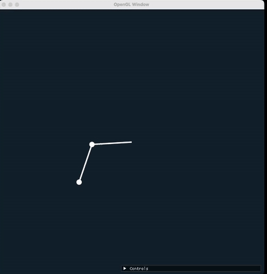
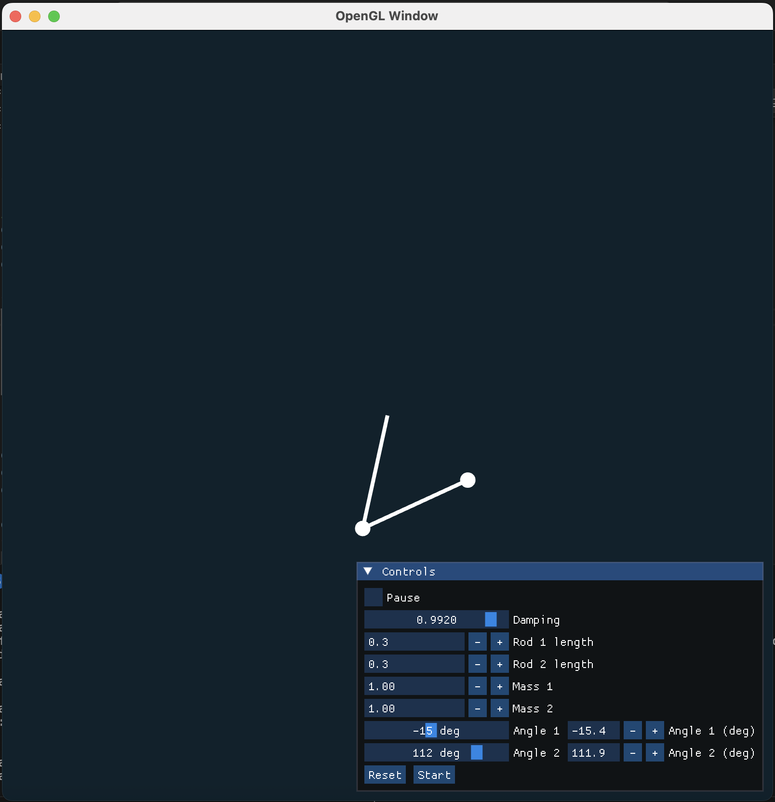
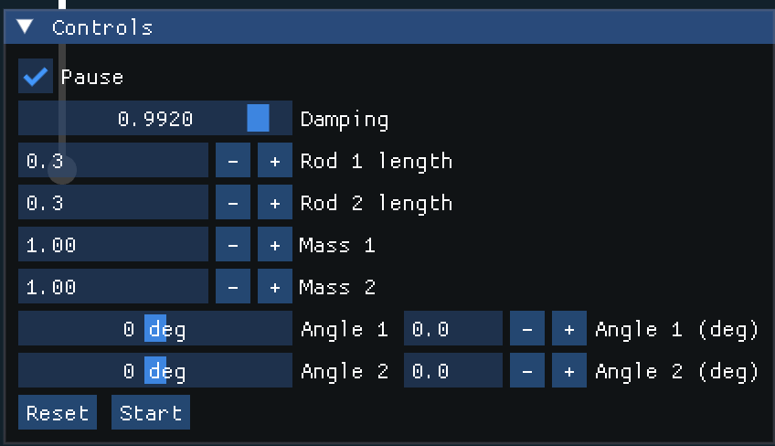
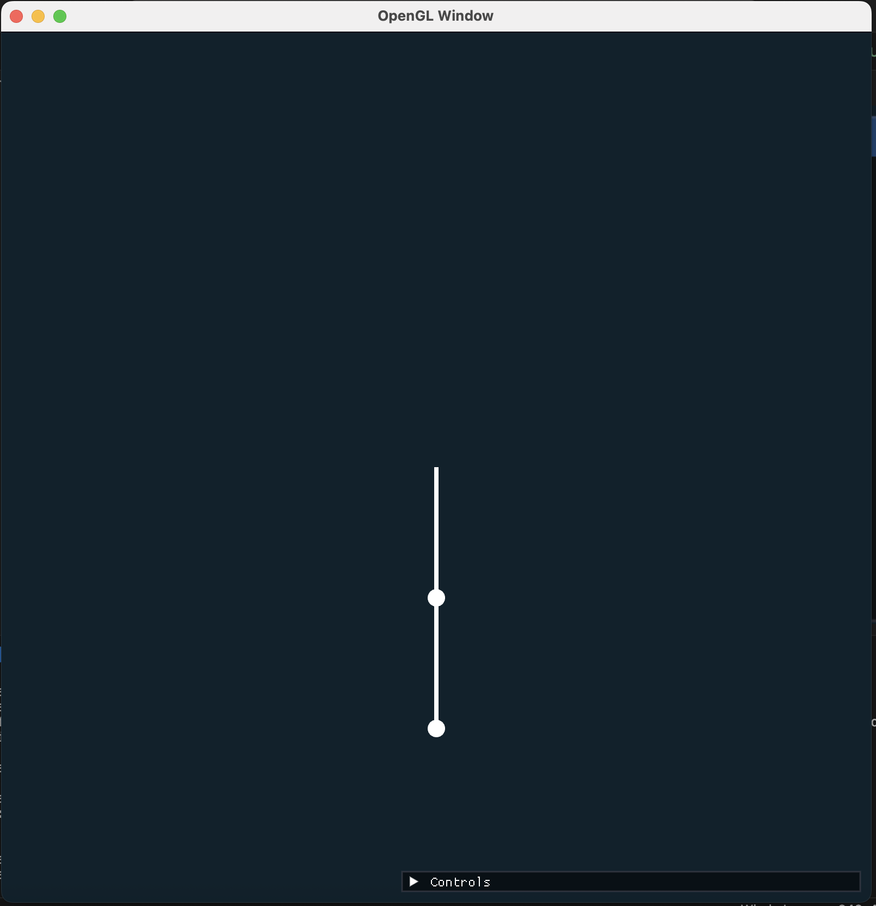

# Double Pendulum Simulation (OpenGL + ImGui)

A real-time, interactive **double pendulum** simulation built with **C++**, **OpenGL**, **GLFW**, **GLAD**, **GLM**, and **Dear ImGui**.  
The simulation allows you to adjust physical parameters, pause/resume motion, and visualize chaotic dynamics in real time.



The double pendulum motion is derived from deterministic equations: nothing is 'random' -- the motion seems random because the pendulums are
chaotic. Slight discrepancies in the initial conditions are amplified exponentially over time.

## Video Demo

[](https://youtu.be/3Q9UUI3JO5o)  
*Click the image above to watch the simulation in action.*

## Features

- Accurate double pendulum physics with adjustable parameters (rod lengths, masses, damping, initial angles).
- Interactive Dear ImGui controls (pause, resume, reset, direct angle input).
- Smooth OpenGL rendering with MSAA.
- Parameter constraints to prevent instability.

## Screenshots

| Control Panel | Simulation |
|---------------|------------|
|  |  |

## Dependencies

- GLFW
- GLAD
- GLM
- Dear ImGui
- C++17 or higher

## Building & Running

1. Clone the repository:
   ```bash
   git clone https://github.com/keanswon/doublependulum.git
   cd double-pendulum-opengl
